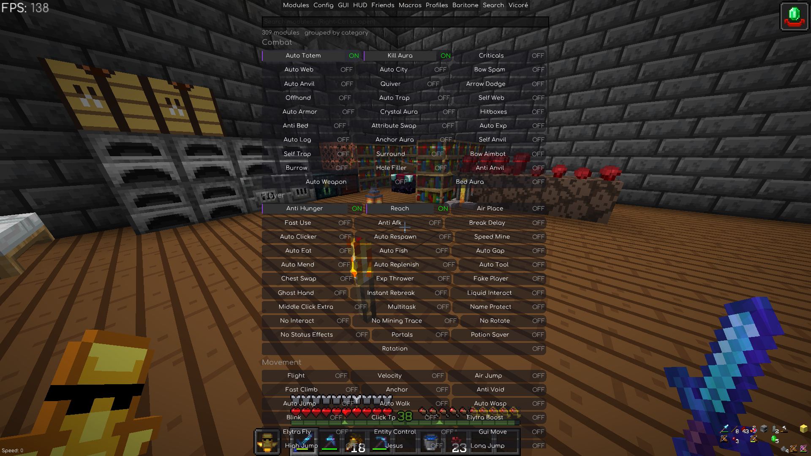

# Better Search

A Meteor Client addon (Minecraft 1.21.11) that adds a proper `Search` tab to the ClickGUI.


<br>

## Features

- Adds a **Search tab** next to Modules / Config / HUD in the Meteor menu.
- Empty search shows **all modules grouped by category**. Typing filters the list
  with fuzzy matching (typos and word order don't matter much).
- Matches names, descriptions, categories, aliases, setting names, and custom
  `@SearchTags` synonyms.
- Rows use Meteor's own module widgets, so they look and click exactly like the
  rest of ClickGUI (active styling included) — no custom drawing to break.
- **Learns what you use** — toggling a module bumps it up in future results.
  Stored in `meteor-client/better-search-usage.json`, delete it to reset.
- Toggling never reshuffles the list — order only changes when your search text does.
- Left-click toggles a module, right-click opens its settings right inside the tab
  (or the normal Meteor window if you turn that off).
- Keyboard: `Up/Down` to move, `Enter` to toggle, `Right` for settings, `Esc` to close.
- Command: `.better-search`, or `.bs` for short. `.bs <text>` lists matches,
  `.bs toggle <text>` toggles the best one.

## Install

1. Minecraft 1.21.11 with Fabric Loader 0.18.2.
2. Meteor Client for 1.21.11 in `mods/`.
3. Drop the `better-search-*.jar` from this repo's `build/libs/` into `mods/` too.
4. Open Meteor with `Right Shift`, click the **Search** tab. Or just press `Right-Ctrl`.

## Settings

Under ClickGUI → Better Search → `better-search`. The useful ones:

- `max-results` — how many rows when filtering (default 100, empty search always shows everything)
- `columns` — modules per line, 1–3
- `panel-width`, `row-gap`, `row-inner-gap` — sizing and density
- `show-category`, `show-status`, `inline-outline` — which bits to display
- `learn-usage` — turn off if you don't want usage-based ranking
- `inline-settings` — off = module settings open in a normal draggable Meteor window
- `draggable-panel` — shows a drag handle to move the panel around

For addon devs: annotate your modules with `@SearchTags({"alias", "synonym"})`
from this mod and they'll show up under those words too.

## Build it yourself

Needs Java 21.

```bash
./gradlew build
```

Jar lands in `build/libs/`. For a live dev client: `./gradlew runClient`.

Pinned versions: MC 1.21.11, Yarn `1.21.11+build.3`, Loader 0.18.2, Loom 1.14,
Meteor `1.21.11-SNAPSHOT` (see `gradle/libs.versions.toml`).

## License

CC0, do what you want.
